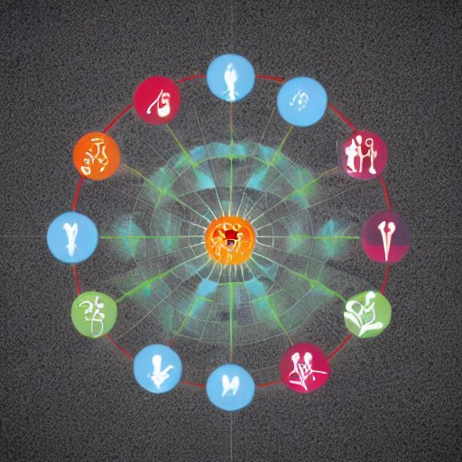

<a name="readme-top"></a>

<!-- PROJECT SHIELDS -->
<!--
*** I'm using markdown "reference style" links for readability.
*** Reference links are enclosed in brackets [ ] instead of parentheses ( ).
*** See the bottom of this document for the declaration of the reference variables
*** for contributors-url, forks-url, etc. This is an optional, concise syntax you may use.
*** https://www.markdownguide.org/basic-syntax/#reference-style-links
-->
<!-- [![Contributors][contributors-shield]][contributors-url]
[![Forks][forks-shield]][forks-url]
[![Stargazers][stars-shield]][stars-url]
[![Issues][issues-shield]][issues-url] -->
[![MIT License][license-shield]][license-url]


<!-- PROJECT LOGO -->
<br />
<div align="center">
  <a href="https://github.com/0xartem/emofties">
    
  </a>

<h3 align="center">Emofties</h3>

  <p align="center">
    Decentralized Sentiment Social Graph
    <!-- <br />
    <a href="https://github.com/0xartem/emofties"><strong>Explore the docs »</strong></a> -->
    <br />
    <br />
    <a href="https://emofties.vercel.app">View Demo</a>
    ·
    <a href="https://taikai.network/ethlisbon/hackathons/ethlisbon-2022/projects/cl9v7bnj6116831101ttvv7n7rdf/idea">ETHLisbon Hackathon Submission</a>
    ·
    <a href="https://github.com/0xartem/emofties/issues">Report Bug</a>
    ·
    <a href="https://github.com/0xartem/emofties/issues">Request Feature</a>
  </p>
</div>


<!-- TABLE OF CONTENTS -->
<details>
  <summary>Table of Contents</summary>
  <ol>
    <li>
      <a href="#about-the-project">About The Project</a>
      <ul>
        <li><a href="#built-with">Built With</a></li>
      </ul>
    </li>
    <li>
      <a href="#getting-started">Getting Started</a>
      <ul>
        <li><a href="#prerequisites">Prerequisites</a></li>
        <li><a href="#installation">Installation</a></li>
      </ul>
    </li>
    <li><a href="#contributing">Contributing</a></li>
    <li><a href="#license">License</a></li>
    <li><a href="#contact">Contact</a></li>
    <li><a href="#acknowledgments">Acknowledgments</a></li>
  </ol>
</details>


<!-- ABOUT THE PROJECT -->
## About The Project

[![Product Name Screen Shot][product-screenshot]](https://emofties.vercel.app)

<p align="right">(<a href="#readme-top">back to top</a>)</p>

### Motivation
* We can hold and transfer not only financial value now. NFTs allow us to own and transfer cultural and social values.
* As we build together and use Web3 - we always feel something. We feel joy, love, fear, doubt, uncertainty, anger, sadness, excitement, the list goes on.
* We move more into the online and metaverse worlds and don’t always have a chance to meet a person IRL to share an emotion we are feeling right now.
* Web2 decided what is ok for us to feel in social media experiences

### What is it?
**Emofties** - is a **decentralized sentiment social graph** that connects Web3 users on an emotional level, allowing them to see how everyone is feeling in the **present moment**.

### Use Cases
* Emofties can be used in different social experiences: games, social network apps, education, public goods funding, crowdsourcing
* DAOs can use it to better understand the community. The emotional state of the people participating in the shared experience
* A dApp powered by this protocol can reflect the emotional state of a chain, protocol, community, any criteria-based group of accounts

### How It Works?
* Share an Emofty for any emotion (excitement, surprise, fury) openly. Or send it to a user, contract or group of users. They can mint it on-demand if they want to
* Attach media or a memo to an Emofty using AI-generative art or other creative tools
* There is a POC implementation of the protocol on Ethereum and Arweave.


### Built With

[![Solidity][Solidity.org]][Solidity-url]
[![Vitejs][Vitejs.dev]][Vite-url]
[![React][React.js]][React-url]
[![Apollo GraphQL][Apollographql.com]][ApolloGraphQL-url]
[![TailwindCSS][tailwindcss.com]][Tailwindcss-url]

<p align="right">(<a href="#readme-top">back to top</a>)</p>


<!-- GETTING STARTED -->
## Getting Started

### Prerequisites

Install `yarn` or `npm` 

### Installation

1. Clone the repo
   ```sh
   git clone https://github.com/0xartem/emofties.git
   ```
2. Install packages
   ```sh
   yarn install && cd ./dapp && yarn install && cd ..
   ```
3. Compile contracts
   ```sh
   yarn hardhat compile
   ```
4. Enter your API `VITE_ALCHEMY_API_KEY` in the `./dapp/.env `
5. Start the dApp
   ```sh
   cd ./dapp && yarn dev
   ```

<p align="right">(<a href="#readme-top">back to top</a>)</p>

<!-- CONTRIBUTING -->
## Contributing

If you have a suggestion that would make this better, please fork the repo and create a pull request. You can also simply open an issue with the tag "enhancement".
Don't forget to give the project a star! Thanks again!

1. Fork the Project
2. Create your Feature Branch (`git checkout -b feature/AmazingFeature`)
3. Commit your Changes (`git commit -m 'Add some AmazingFeature'`)
4. Push to the Branch (`git push origin feature/AmazingFeature`)
5. Open a Pull Request

<p align="right">(<a href="#readme-top">back to top</a>)</p>


<!-- LICENSE -->
## License

Distributed under the MIT License. See `LICENSE.txt` for more information.

<p align="right">(<a href="#readme-top">back to top</a>)</p>


<!-- CONTACT -->
## Contact

Twitter - [@artem0x](https://twitter.com/artem0x)

Project Link: [https://github.com/0xartem/emofties](https://github.com/0xartem/emofties)

<p align="right">(<a href="#readme-top">back to top</a>)</p>


<!-- MARKDOWN LINKS & IMAGES -->
<!-- https://www.markdownguide.org/basic-syntax/#reference-style-links -->
[contributors-shield]: https://img.shields.io/github/contributors/0xartem/emofties?color=blue&style=for-the-badge
[contributors-url]: https://github.com/0xartem/emofties/graphs/contributors
[forks-shield]: https://img.shields.io/github/forks/0xartem/emofties.svg?style=for-the-badge
[forks-url]: https://github.com/0xartem/emofties/network/members
[stars-shield]: https://img.shields.io/github/stars/0xartem/emofties.svg?style=for-the-badge
[stars-url]: https://github.com/0xartem/emofties/stargazers
[issues-shield]: https://img.shields.io/github/issues/0xartem/emofties.svg?style=for-the-badge
[issues-url]: https://github.com/0xartem/emofties/issues
[license-shield]: https://img.shields.io/github/license/0xartem/emofties.svg?style=for-the-badge
[license-url]: https://github.com/0xartem/emofties/blob/main/LICENSE.txt
[product-screenshot]: docs/images/home-page-screenshot.png
[Vitejs.dev]: https://img.shields.io/badge/Vitejs-000000?style=for-the-badge&logo=vite&logoColor
[Vite-url]: https://vitejs.dev/
[React.js]: https://img.shields.io/badge/React-20232A?style=for-the-badge&logo=react&logoColor=61DAFB
[React-url]: https://reactjs.org/
[Solidity.org]: https://img.shields.io/badge/Solidity-363636?style=for-the-badge&logo=solidity&logoColor=white
[Solidity-url]: https://soliditylang.org/
[Apollographql.com]: https://img.shields.io/badge/Apollo%20GraphQL-E10098?style=for-the-badge&logo=Apollo-GraphQL&logoColor=311C87
[ApolloGraphQL-url]: https://www.apollographql.com/
[tailwindcss.com]: https://img.shields.io/badge/Tailwind%20CSS-053766?style=for-the-badge&logo=Tailwind%20CSS&logoColor=06B6D4
[Tailwindcss-url]: https://www.tailwindcss.com/
